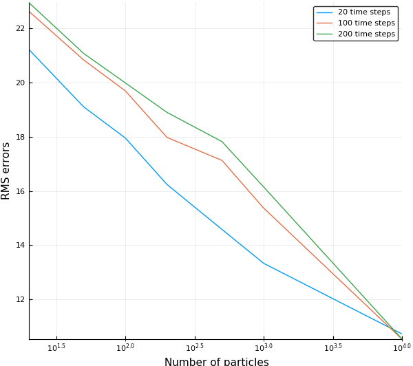
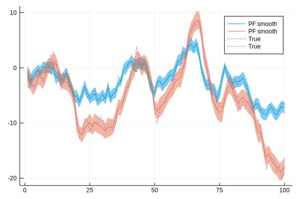
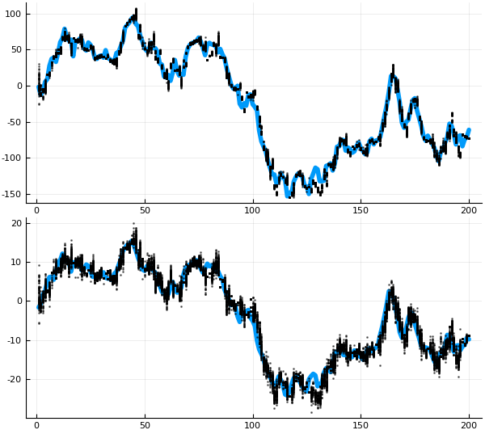
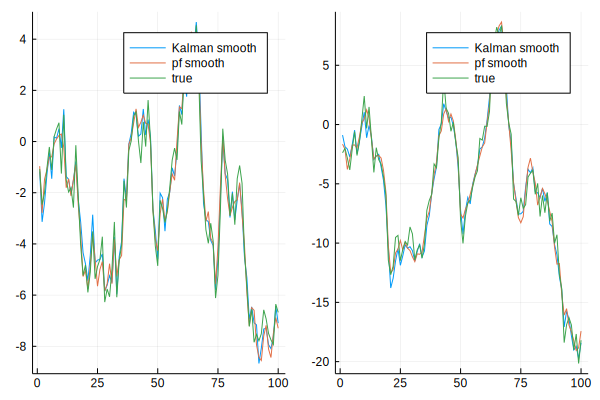
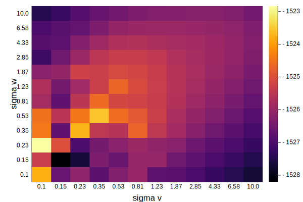
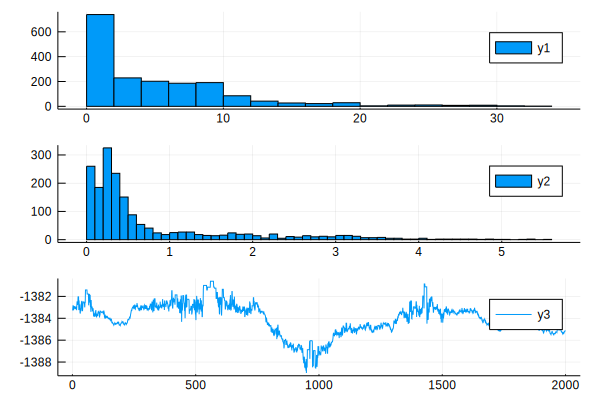

# LowLevelParticleFilters
[](https://travis-ci.org/baggepinnen/LowLevelParticleFilters.jl)
[](https://codecov.io/gh/baggepinnen/LowLevelParticleFilters.jl)

This readme is auto generated from the file [src/example_lineargaussian.jl](https://github.com/baggepinnen/LowLevelParticleFilters.jl/blob/master/src/example_lineargaussian.jl) using [Literate.jl](https://github.com/fredrikekre/Literate.jl)

# Types
We provide three filter types
- `ParticleFilter`: This filter is simple to use and assumes that both dynamics noise and measurement noise are additive.
- `AdvancedParticleFilter`: This filter gives you more flexibility, at the expense of having to define a few more functions.
- `KalmanFilter`. Is what you would expect. Has the same features as the particle filters, but is restricted to linear dynamics and gaussian noise.

# Functionality
- Filtering
- Smoothing
- Parameter estimation using ML or PMMH (Particle Marginal Metropolis Hastings)

# Usage example
This example demostrates how we set up the filters, both PF and KF, for a simple linear system.

## Particle filter
Defining a particle filter is straightforward, one must define the distribution of the noise `df` in the dynamics function, `dynamics(x,u)` and the noise distribution `dg` in the measurement function `measurement(x)`. The distribution of the initial state `d0` must also be provided. An example for a linear Gaussian system is given below.

```julia
using LowLevelParticleFilters, LinearAlgebra, StaticArrays, Distributions, RecursiveArrayTools, BenchmarkTools, StatsPlots
```

Define problem

```julia
n = 2 # Dinemsion of state
m = 2 # Dinemsion of input
p = 2 # Dinemsion of measurements

const dg = MvNormal(p,1.0)          # Measurement noise Distribution
const df = MvNormal(n,1.0)          # Dynamics noise Distribution
const d0 = MvNormal(randn(n),2.0)   # Initial state Distribution
```

Define random linear state-space system

```julia
Tr = randn(n,n)
const A = SMatrix{n,n}(Tr*diagm(0=>LinRange(0.5,0.95,n))/Tr)
const B = @SMatrix randn(n,m)
const C = @SMatrix randn(p,n)

# The following two functions are required by the filter
dynamics(x,u) = A*x .+ B*u
measurement(x) = C*x
```
We are now ready to define and use a filter
```julia
pf = ParticleFilter(N, dynamics, measurement, df, dg, d0)
pf(u, y) # Perform one filtering step using input u and measurement y
particles(pf) # Query the filter for particles, try weights(pf) or expweights(pf) as well
x̂ = weigthed_mean(pf)
```

If you want to perform filtering using vectors of inputs and measurements, try any of the functions
```julia
x,w,we,ll = forward_trajectory(pf, u, y)
x̂,ll = mean_trajectory(pf, u, y)
```

To see how the performance varies with the number of particles, we simulate several times. The following code simulates the system and performs filtering using the simulated measuerments. We do this for varying number of time steps and varying number of particles.

```julia
function run_test()
    particle_count = [10, 20, 50, 100, 200, 500, 1000]
    time_steps = [20, 100, 200]
    RMSE = zeros(length(particle_count),length(time_steps)) # Store the RMS errors
    propagated_particles = 0
    t = @elapsed for (Ti,T) = enumerate(time_steps)
        for (Ni,N) = enumerate(particle_count)
            montecarlo_runs = 2*maximum(particle_count)*maximum(time_steps) ÷ T ÷ N
            E = sum(1:montecarlo_runs) do mc_run
                pf = ParticleFilter(N, dynamics, measurement, df, dg, d0) # Create filter
                u = SVector{2,Float64}(randn(2))
                x = SVector{2,Float64}(rand(d0))
                y = SVector{2,Float64}(sample_measurement(pf,x,1))
                error = 0.0
                @inbounds for t = 1:T-1
                    pf(u, y) # Update the particle filter
                    x = dynamics(x,u) + SVector{2,Float64}(rand(df)) # Simulate the true dynamics and add some noise
                    y = SVector{2,Float64}(sample_measurement(pf,x,t)) # Simulate a measuerment
                    u = @SVector randn(2) # draw a random control input
                    error += sum(abs2,x-weigthed_mean(pf))
                end # t
                √(error/T)
            end # MC
            RMSE[Ni,Ti] = E/montecarlo_runs
            propagated_particles += montecarlo_runs*N*T
            @show N
        end # N
        @show T
    end # T
    println("Propagated $propagated_particles particles in $t seconds for an average of $(propagated_particles/t/1000) particles per millisecond")
    return RMSE
end

@time RMSE = run_test()
```

Propagated 8400000 particles in 3.568745383 seconds for an average of 2353.7683691344473 particles per millisecond

We then plot the results

```julia
time_steps     = [20, 100, 200]
particle_count = [10, 20, 50, 100, 200, 500, 1000]
nT             = length(time_steps)
leg            = reshape(["$(time_steps[i]) time steps" for i = 1:nT], 1,:)
plot(particle_count,RMSE,xscale=:log10, ylabel="RMS errors", xlabel=" Number of particles", lab=leg)
gui()
```



# Smoothing
We also provide a particle smoother, based on forward filtering, backward simulation (FFBS)

```julia
N     = 2000 # Number of particles
T     = 200 # Number of time steps
M     = 100 # Number of smoothed backwards trajectories
pf    = ParticleFilter(N, dynamics, measurement, df, dg, d0)
du    = MvNormal(2,1) # Control input distribution
x,u,y = simulate(pf,T,du) # Simulate trajectory using the model in the filter
tosvec(y) = reinterpret(SVector{length(y[1]),Float64}, reduce(hcat,y))[:] |> copy
x,u,y = tosvec.((x,u,y))

xb,ll = smooth(pf, M, u, y) # Sample smooting particles
xbm = smoothed_mean(xb)     # Calculate the mean of smoothing trajectories
xbc = smoothed_cov(xb)      # And covariance
xbt = smoothed_trajs(xb)    # Get smoothing trajectories
xbs = [diag(xbc) for xbc in xbc] |> vecvec_to_mat .|> sqrt
plot(xbm', ribbon=2xbs, lab="PF smooth")
plot!(vecvec_to_mat(x), l=:dash, lab="True")
```



We can plot the particles themselves as well

```julia
plot(vecvec_to_mat(x), l=(4,), layout=(2,1), show=false)
scatter!(xbt[1,:,:]', subplot=1, show=false, m=(1,:black, 0.5), lab="Backwards trajectories")
scatter!(xbt[2,:,:]', subplot=2, m=(1,:black, 0.5), lab="Backwards trajectories")
```



# Kalman filter
A Kalman filter is easily created using the constructor. Many of the functions defined for particle filters, are defined also for Kalman filters, e.g.:

```julia
eye(n) = Matrix{Float64}(I,n,n)
kf     = KalmanFilter(A, B, C, 0, eye(n), eye(p), MvNormal([1.,1.]))
xf,xt,R,Rt,ll = forward_trajectory(kf, u, y) # filtered, prediction, pred cov, filter cov, loglik
xT,R,lls = smooth(kf, u, y) # Smoothed state, smoothed cov, loglik
```

It can also be called in a loop like the `pf` above

```julia
for t = 1:T
    kf(u,y) # Performs both predict! and correct!
    # alternatively
    predict!(kf, u, t)
    x   = state(kf)
    R   = covariance(kf)
    ll += correct!(kf, y, t) # Returns loglik
end
```

# Parameter estimation
We provide som basic functionality for maximum likelihood estimation and MAP estimation
## ML estimation
Plot likelihood as function of the variance of the dynamics noise

```julia
svec = exp10.(LinRange(-1.5,3,60))
llspf = map(svec) do s
    df = MvNormal(n,s)
    pfs = ParticleFilter(2000, dynamics, measurement, df, dg, d0)
    loglik(pfs,u,y)
end
plot(svec, llspf, xscale=:log10, title="Log-likelihood", xlabel="Dynamics noise standard deviation")
vline!([svec[findmax(llspf)[2]]], l=(:dash,:blue))
```

We can do the same with a Kalman filter

```julia
eye(n) = Matrix{Float64}(I,n,n)
llskf = map(svec) do s
    kfs = KalmanFilter(A, B, C, 0, s^2*eye(n), eye(p), d0)
    loglik(kfs,u,y)
end
plot!(twinx(),svec, llskf, yscale=:identity, xscale=:log10, ylabel="Kalman (red)", c=:red)
vline!([svec[findmax(llskf)[2]]], l=(:dash,:red))
```


as we can see, the result is quite noisy due to the stochastic nature of particle filtering.

### Smoothing using KF

```julia
kf = KalmanFilter(A, B, C, 0, eye(n), eye(p), MvNormal(2,1))
xf,xh,R,Rt,ll = forward_trajectory(kf, u, y) # filtered, prediction, pred cov, filter cov, loglik
xT,R,lls = smooth(kf, u, y) # Smoothed state, smoothed cov, loglik
```

Plot and compare PF and KF

```julia
plot(vecvec_to_mat(xT), lab="Kalman smooth", layout=2)
plot!(xbm', lab="pf smooth")
plot!(vecvec_to_mat(x), lab="true")
```



## MAP estiamtion
To solve a MAP estimation problem, we need to define a function that takes a parameter vector and returns a particle filter

```julia
filter_from_parameters(θ) = ParticleFilter(N, dynamics, measurement, MvNormal(n,exp(θ[1])), MvNormal(p,exp(θ[2])), d0)
```

The call to `exp` on the parameters is so that we can define log-normal priors

```julia
priors = [Normal(1,2),Normal(1,2)]
plot_priors(priors)
```

Now we call the function `log_likelihood_fun` that returns a function to be minimized

```julia
ll = log_likelihood_fun(filter_from_parameters,priors,u,y)
```

Since this is a low-dimensional problem, we can plot the LL on a 2d-grid

```julia
Nv = 20
v = LinRange(-0.7,1,Nv)
llxy = (x,y) -> ll([x;y])
VGx, VGy = meshgrid(v,v)
VGz = llxy.(VGx, VGy)
heatmap(VGz, xticks=(1:Nv,round.(v,digits=2)),yticks=(1:Nv,round.(v,digits=2)), xlabel="sigma v", ylabel="sigma w") # Yes, labels are reversed
```



Something seems to be off with this figure as the hottest spot is not really where we would expect it

Optimization of the log likelihood can be done by, e.g., global/black box methods, see [BlackBoxOptim.jl](https://github.com/robertfeldt/BlackBoxOptim.jl). Standard tricks apply, such as performing the parameter search in log-space etc.

## Bayesian inference using PMMH
This is pretty cool. We procede like we did for MAP above, but when calling the function `metropolis`, we will get the entire posterior distribution of the parameter vector, for the small cost of a massive increase in computational cost.

```julia
N = 1000
filter_from_parameters(θ) = ParticleFilter(N, dynamics, measurement, MvNormal(n,exp(θ[1])), MvNormal(p,exp(θ[2])), d0)
```

The call to `exp` on the parameters is so that we can define log-normal priors

```julia
priors = [Normal(1,2),Normal(1,2)]
ll     = log_likelihood_fun(filter_from_parameters,priors,u,y)
θ₀ = log.([1.,1.]) # Starting point
```

We also need to define a function that suggests a new point from the "proposal distribution". This can be pretty much anything, but it has to be symmetric since I was lazy and simplified an equation.

```julia
draw = θ -> θ .+ rand(MvNormal(0.1ones(2)))
burnin = 200
@time theta, lls = metropolis(ll, 2000, θ₀, draw) # Run PMMH for 2000  iterations, takes about half a minute on my laptop
thetam = reduce(hcat, theta)'[burnin+1:end,:] # Build a matrix of the output (was vecofvec)
histogram(exp.(thetam), layout=(3,1)); plot!(lls, subplot=3) # Visualize
```



If you are lucky, you can run the above threaded as well. I tried my best to make particle fitlers thread safe with their own rngs etc., but your milage may vary.

```julia
@time thetalls = LowLevelParticleFilters.metropolis_threaded(burnin, ll, 500, θ₀, draw)
histogram(exp.(thetalls[:,1:2]), layout=3)
plot!(thetalls[:,3], subplot=3)
```

*This page was generated using [Literate.jl](https://github.com/fredrikekre/Literate.jl).*
